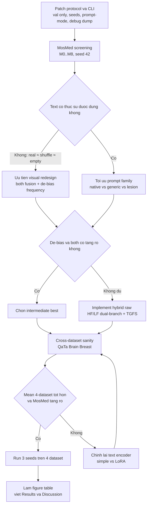

# Kế hoạch nâng MosMed và tổng quát hóa chéo dataset cho text-FAENet

## Tóm tắt điều hành

**Khoảng cách MosMed của mô hình hiện tại là đủ lớn để không thể giải thích chỉ bằng khác biệt prompt; nút thắt chính nhiều khả năng nằm ở thiết kế thị giác–tần số và độ mạnh của text fusion.** FMISeg đạt 79.30 Dice / 65.71 mIoU trên MosMed, còn bản không dùng text của họ vẫn đạt 76.45 / 62.87; trong khi kết quả MosMed hiện tại của bạn là 67.57 / 53.51. citeturn3view0

**Nếu mục tiêu là vừa kéo MosMed lên vùng cạnh tranh vừa giữ được 4-dataset applicability, thứ tự đúng là: sửa protocol và ablation để chẩn đoán, nới các bias tần số cứng, thử `fusion_mode=both` và text encoder phù hợp hơn, rồi mới đầu tư vào bản hybrid raw HF/LF dual-branch kiểu FMISeg + TGFS decoder.** citeturn3view0turn15view0turn16search7

**Với bộ 4 dataset mà bạn chọn, paper nên kể như một model paper về “text-guided frequency-aware segmentation across heterogeneous radiology datasets”, nhưng headline result phải được xây trên cải thiện ổn định và ablation sạch, không phải chỉ trên một benchmark đơn lẻ.** MedCLIP-SAMv2 cũng đi theo logic này khi đánh trên 4 modality/task và chỉ ra rằng prompt tốt cho breast/brain không trùng với prompt tốt cho lung CT/X-ray. citeturn7view0turn9view1turn9view2

## Chẩn đoán hiện trạng

Bốn con số bạn báo hiện nay cho thấy một pattern khá rõ:

| Dataset | Dice hiện tại | IoU hiện tại | Ghi chú nhanh |
|---|---:|---:|---|
| QaTa-COV19 v2 | 0.8169 | 0.7254 | tốt nhất trong 4 bộ |
| MosMed | 0.6757 | 0.5351 | thấp hơn đáng kể so với chest benchmark kỳ vọng |
| Brain (Cheng 2017) | 0.7428 | 0.6386 | trung bình khá |
| Breast (BUSI/UDIAT setting) | 0.5927 | 0.4706 | yếu nhất |

Trên MosMed, `pred_pos_ratio=0.0194` khá gần `gt_pos_ratio=0.0156`; trên Brain cũng gần nhau. Điều này gợi ý lỗi chính của hai bộ này **không phải calibration/threshold**, mà là **shape, boundary, alignment**. Breast thì khác: `pred_pos_ratio=0.0842` gần gấp đôi `gt_pos_ratio=0.0388`, nên ở đó có thêm lỗi **over-segmentation** và có thể là bias tần số hoặc text/domain mismatch. Đây là dấu hiệu quan trọng để ưu tiên MosMed theo hướng **tăng chất lượng visual-frequency interaction**, còn Breast theo hướng **nới bias HH và làm prompt/class conditioning rõ hơn**.

Phần cách biệt với literature cũng nói cùng một câu chuyện. FMISeg dùng đúng hai benchmark chest là QaTa-COV19 và MosMedData+, giải bài toán pulmonary infection segmentation bằng cách tách **LF/HF từ ảnh đầu vào**, dùng **dual-branch encoder**, **FFBI** để cho hai nhánh tần số tương tác hai chiều, rồi **LFFI** để đưa text vào decoder theo từng tầng; kết quả là 91.21/83.84 trên QaTa và 79.30/65.71 trên MosMed. Quan trọng hơn, bản **No Text** của FMISeg vẫn đạt 87.63/78.13 trên QaTa và 76.45/62.87 trên MosMed; tức là visual-frequency pipeline của họ đã mạnh trước khi có text. citeturn3view0turn4view0

Điều này dẫn tới một kết luận rất thực dụng: **MosMed của bạn đang thấp hơn không chỉ FMISeg đầy đủ, mà còn thấp hơn cả FMISeg no-text**. Vì vậy, không nên quy nguyên nhân chính cho “prompt format khác” hay “text chưa đẹp” mà phải xem đây là bài toán **thiết kế thị giác trước, text sau**. MedCLIP-SAMv2 cũng cho thấy prompt có ảnh hưởng rõ, nhưng ảnh hưởng đó **phụ thuộc dataset**: prompt generic phù hợp hơn cho lung CT/X-ray, còn prompt class-specific mô tả giàu ngữ cảnh lại tốt hơn cho breast và brain. citeturn3view0turn9view1turn9view2

Bản thân 4 dataset của bạn cũng không đồng nhất về protocol. Theo MedCLIP-SAMv2, bộ breast của họ là **BUSI cho train**, còn **UDIAT cho val/test**; brain dùng **Cheng brain tumor dataset** với split 1462/1002/600; lung X-ray dùng COVID-QU-Ex; lung CT dùng Konya-split theo patient ID. Điều đó có nghĩa là nếu bạn muốn bám setting của MedCLIP-SAMv2 cho brain/breast, bạn cần ghi cực rõ đây là **cross-dataset breast protocol** chứ không phải random split chuẩn trên BUSI. citeturn11view0turn11view1turn11view3

Ở góc nhìn inductive bias, code hiện tại của bạn gần FAENet hơn là FMISeg. FAENet gốc làm DWT trên **feature map nội bộ**, tách `LL/LH/HL/HH`, rồi dùng attention trong miền tần số để làm sắc biên và giữ chi tiết. Đây là một tư duy hợp lý cho refinement, nhưng khác về bản chất với **raw-image dual-branch LF/HF** của FMISeg. FAENet mạnh ở chỗ cải thiện boundary/detail qua feature-level frequency attention; FMISeg mạnh ở chỗ ngay từ ảnh đầu vào đã ép encoder học **semantic coarse từ LF** và **detail từ HF** theo hai dòng riêng. citeturn15view0turn3view0

Từ đây, chẩn đoán ưu tiên nên được xếp như sau:

1. **Visual-frequency design chưa đủ mạnh cho MosMed**.  
2. **Decoder-only text fusion có thể quá nhẹ với CT**, nhất là khi cạnh tranh với FMISeg-style multi-stage interaction.  
3. **CXR-BERT frozen là lựa chọn chest-friendly nhưng không phải universal**, nên dễ làm brain/breast hụt.  
4. **Prompt family chưa được chuẩn hóa theo dataset**, trong khi literature cho thấy prompt tối ưu cho lung và tumor là khác nhau. citeturn3view0turn7view0turn9view1turn9view2

## Thay đổi ưu tiên trong mã và kiến trúc

### Bảng ưu tiên tổng hợp

| Biến thể / thay đổi | `fusion_mode` | Text encoder | Thiết kế tần số | Δ tham số học được | Kỳ vọng tác động | Độ khó |
|---|---|---|---|---|---|---|
| V0. Baseline hiện tại | decoder | CXR-BERT frozen | DWT nội bộ, `drop_hh=True`, `hf_scale=0.6`, `sharpen=2.0` | 0 | mốc so sánh | thấp |
| V1. Mở text vào encoder + decoder | both | giữ encoder hiện tại | như V0 | tăng vừa; trong bản simple-text local xấp xỉ +25.8M so với decoder-only | +0.5 đến +2 Dice MosMed; có thể tốt hơn cho brain | thấp–trung bình |
| V2. Chuẩn hóa prompt theo dataset | giữ như V0/V1 | giữ nguyên | như V0/V1 | không đổi | lung: +0.5 đến +1.5; brain/breast: +1 đến +4 nếu prompt class-specific tốt | thấp |
| V3. Simple text encoder | decoder/both | simple | như V0/V1 | giảm rất mạnh tổng params; encoder simple local ~8.3M | có thể tăng brain/breast, giảm nhẹ hoặc không đổi chest | thấp |
| V4. CXR-BERT + LoRA hoặc unfreeze 1–2 block cuối | decoder/both | CXR-BERT LoRA / partial unfreeze | như V0/V1 | tăng nhỏ đến vừa trainable params | +1 đến +3 trên bộ prompt nghèo / mismatch | trung bình |
| V5. Bỏ bias tần số cứng, thay bằng learnable gates | decoder/both | encoder tốt nhất | `HH` learned, `hf_scale` learned, `sharpen` learned/anneal | tăng rất nhỏ | +1 đến +2 MosMed; +2 đến +4 Breast | thấp–trung bình |
| V6. Hybrid raw HF/LF dual-branch + TGFS decoder | both ưu tiên | encoder tốt nhất | **ảnh đầu vào** tách LF/HF + FFBI-lite + TGFS | tăng lớn, ước lượng 1.6–2.0× visual trunk | **thay đổi quan trọng nhất**; +4 đến +8 MosMed là realistic | cao |
| V7. Final paper model | both hoặc hybrid | simple hoặc LoRA compromise | hybrid + learnable priors + prompt policy | tùy cấu hình | mục tiêu cạnh tranh FMISeg vùng 76–79 Dice MosMed, đồng thời không sụp trên 3 bộ còn lại | cao |

Nhìn vào các mức tác động dự kiến, chỉ có **V6** mới đủ sức kéo MosMed từ 67.6 lên vùng 76–79 Dice. Các biến thể còn lại vẫn rất đáng làm, nhưng chủ yếu là **incremental gains** hoặc **bộ lọc chẩn đoán**.

### Thay đổi nào nên làm ngay trong code

Việc đầu tiên không phải là thay kiến trúc, mà là **mở khóa không gian ablation**. Hiện các script huấn luyện đang để `--use-cxr-bert` và `--freeze-text-backbone` theo kiểu boolean mặc định bật, khiến việc tắt chúng bằng CLI không thuận tiện. Nên đổi cả `train_mosmed_text.py`, `train_qata.py`, và `run_text_faenet_suite.py` sang `BooleanOptionalAction`, đồng thời thêm các cờ:

- `--prompt-mode {native, canonical, generic, lesion, empty, shuffle}`
- `--hh-drop-mode {zero, keep, learned}`
- `--unfreeze-last-n`
- `--lora-r`
- `--grad-accum-steps`
- `--save-debug-vis`

Đây là thay đổi nhỏ nhưng là điều kiện bắt buộc để làm thí nghiệm tử tế.

Thay đổi ưu tiên số hai là **nới các prior tần số cứng trong `lfaenet_tgfs_v2.py`**. Hiện mô hình đang giả định trước rằng `HH` nên bị bỏ ở decoder, `LH/HL` tầng nông nên bị scale xuống 0.6, và map grounding nên bị sharpen bằng lũy thừa 2.0. Với tổn thương phổi dạng diffuse thì bias này có thể có ích; nhưng với breast tumor nhỏ và biên khó, hoặc với MosMed CT phải tách hai lobe, đó là giả định quá sớm. Nên thay ba thứ này bằng tham số học được theo stage hoặc ít nhất là cho phép `"keep"` và `"learned"` thay vì chỉ `"zero"`. Theo FAENet, vai trò mạnh nhất của frequency attention là **giữ chi tiết biên**, chứ không phải mặc định bỏ band cao. citeturn15view0

Thay đổi ưu tiên số ba là **thử `fusion_mode=both` một cách nghiêm túc**. FMISeg cho thấy việc inject text dần từ high-level xuống low-level làm kết quả tăng đều trên cả QaTa và MosMed; điều này gợi ý rằng decoder-only gating có thể chưa đủ trên CT. Nếu `both` cho MosMed tăng rõ >1 Dice mà không phá QaTa quá mạnh, đây có thể là cấu hình tạm tốt trước khi nhảy sang hybrid lớn hơn. citeturn3view0

Thay đổi ưu tiên số bốn là **text encoder**. Vì prompt space của QaTa/MosMed/Brain/Breast trong thực tế khá công thức và vocab không quá rộng, một **simple encoder** không phải ablation “vui cho có” mà là ứng viên universal thật sự. Ngược lại, **CXR-BERT frozen** có lợi cho chest nhưng về nguyên tắc là encoder chuyên biệt cho ngữ cảnh chest radiology. Nếu muốn một cấu hình chung cho 4 dataset, frozen CXR-BERT không phải điểm xuất phát tốt nhất. Lộ trình hợp lý là:
- test `simple`,
- test `CXR-BERT frozen`,
- test `CXR-BERT + LoRA` hoặc unfreeze 1–2 block cuối,
rồi chọn theo tiêu chí **gain trung bình 4 dataset**, không theo một bộ duy nhất.

Thay đổi ưu tiên số năm, và cũng là thay đổi lớn nhất, là **bản hybrid raw HF/LF dual-branch**. Ở đây không cần bê nguyên xi FMISeg; chỉ cần mượn đúng inductive bias mạnh nhất của họ:

- DWT ngay trên **ảnh đầu vào** để tạo **LF image** và **HF image**,
- hai encoder visual riêng cho LF và HF,
- một **FFBI-lite** ở bottleneck hoặc 2 stage sâu,
- giữ lại **TGFS-v2** của bạn trong decoder để nâng từ HF/LF lên **text-guided sub-band selection**.

Cách kể paper lúc đó cũng rõ hơn nhiều:  
**FMISeg nói đúng ở chỗ HF/LF raw-image dual-branch là quan trọng; bài của bạn đi thêm một bước ở decoder-side, nơi language không chỉ tương tác với HF/LF, mà còn điều khiển sub-band và grounding map.** FMISeg repo chính thức cũng xác nhận họ lấy text annotation từ LViT và dùng wave transform để tạo HF/LF image trước khi huấn luyện. citeturn4view0turn3view0

## Ma trận thí nghiệm tối thiểu

### Quy tắc chung cho mọi thí nghiệm

Các quy tắc này nên cố định trước khi chạy:

- **Screening**: một seed duy nhất `42`.
- **Confirmatory**: ba seed `42, 3407, 2026`.
- **Checkpoint selection**: luôn chọn `best.pt` theo **val Dice** sau threshold sweep trên **val only**.
- **Threshold sweep**:
  - QaTa / MosMed: `0.35, 0.40, 0.45, 0.50, 0.55`
  - Brain / Breast: `0.25, 0.30, 0.35, 0.40, 0.45, 0.50, 0.55`
- **Không** dùng test để chọn checkpoint.
- **Không** trộn split giữa các variant.
- **Final paper**: báo `mean ± std` trên 3 seeds.

FMISeg dùng split 5,716/1,429/2,113 cho QaTa và 2,183/273/273 cho MosMedData+; nếu local QaTa-v2 của bạn hiện chỉ có train/test, hãy tạo `val_proxy` cố định từ train và nói rất rõ đây là **proxy split**, hoặc khôi phục đúng split LViT/FMISeg nếu mốc file cho phép. citeturn3view0turn4view0

### Ma trận tối thiểu cho MosMed

Mục tiêu của ma trận này là **bóc tách nguyên nhân** với số run ít nhất, trước khi đầu tư vào hybrid nặng.

| ID | Mục tiêu | Cấu hình chính | Prompt mode | Seed | Tiêu chí quyết định |
|---|---|---|---|---:|---|
| M0 | baseline chuẩn | decoder, CXR-BERT frozen, hard priors | native | 42 | mốc gốc |
| M1 | text có giúp thật không | **FAENet visual-only** | none | 42 | nếu M0≈M1 thì text chưa giúp |
| M2 | text branch có bị bypass không | như M0 | shuffle | 42 | nếu M0≈M2 thì fusion text yếu |
| M3 | text identity vs text presence | như M0 | empty/generic | 42 | nếu M0≈M3 thì text semantics yếu |
| M4 | prompt policy | như M0 | canonical/lesion-specific lung prompt | 42 | nếu M4>M0, vấn đề prompt là thật |
| M5 | vị trí fusion | **both** thay cho decoder | tốt nhất giữa native/canonical | 42 | nếu +>1 Dice, giữ both |
| M6 | text encoder universal | như M5 | tốt nhất ở M4 | 42 | nếu simple ≥ frozen CXR-BERT, ưu tiên simple cho 4 dataset |
| M7 | text encoder thích nghi | CXR-BERT + LoRA hoặc unfreeze 1–2 block cuối | tốt nhất ở M4 | 42 | nếu >M5/M6, dùng LoRA/partial unfreeze |
| M8 | nới prior tần số | `HH=keep/learned`, `hf_scale=1.0 বা learned`, `sharpen=1.0/anneal` | best prompt | 42 | nếu +rõ, giữ learnable priors |
| M9 | deep supervision | như best(M5–M8) + deep supervision | best prompt | 42 | nếu +>=0.5 Dice, bật mặc định |
| M10 | visual redesign | **hybrid raw HF/LF dual-branch + TGFS** | best prompt | 42 | nếu +>=3 Dice, đây là hướng khóa kiến trúc |

Sau M0–M10, chỉ cần chọn **top-3** theo val Dice và rerun mỗi cấu hình với 3 seeds. Như vậy tổng chi phí confirmatory là **9 run**, nhưng đổi lại bạn có kết luận rất rõ:

- **Nếu M0≈M2≈M3**: text branch hiện tại gần như vô dụng.  
- **Nếu M5 tăng nhưng M6/M7 không tăng**: vị trí fusion quan trọng hơn encoder text.  
- **Nếu M8 tăng mạnh trên MosMed nhưng không tăng QaTa**: hard priors đang chest-Xray-biased.  
- **Nếu M10 mới thật sự bật**: bottleneck chính là visual-frequency design, không phải prompt.

### Sanity check tối thiểu cho 3 dataset còn lại

Sau khi có top-2 hoặc top-3 từ MosMed, chạy sanity check trên QaTa, Brain, Breast với **seed 42** trước:

| ID | Variant | Dataset | Mục tiêu |
|---|---|---|---|
| C1 | best MosMed variant | QaTa | xem có giữ chest-Xray không |
| C2 | best MosMed variant | Brain | xem encoder/text có đỡ domain mismatch không |
| C3 | best MosMed variant | Breast | xem bias HH/boundary có đỡ không |
| C4 | runner-up variant | QaTa | tránh overfit riêng MosMed |
| C5 | runner-up variant | Brain | chọn cấu hình compromise |
| C6 | runner-up variant | Breast | chọn cấu hình compromise |

**Quy tắc chọn final model cho paper** nên là:

- tối đa hóa **trung bình Dice** trên 4 dataset,
- với ràng buộc **MosMed phải tăng rõ**,
- và **không dataset nào rơi quá 1.5 Dice** so với baseline, trừ khi tổng lợi ích trên 4 bộ là lớn hơn rõ rệt.

Nếu muốn mạnh hơn một chút mà vẫn tiết kiệm, có thể thêm **1 warm-start multi-dataset pretraining**: trộn 4 dataset trong 10–15 epoch với balanced sampling, rồi fine-tune riêng từng dataset. Đây không phải bước đầu tiên, nhưng là bước tốt nếu paper muốn nhấn “cross-dataset applicability”.

## Recipe huấn luyện và chuẩn đánh giá

### Những gì nên cố định theo FMISeg

FMISeg dùng `224×224`, **AdamW**, learning rate khởi đầu `3e-4`, giảm về `1e-6`, schedule **cosine annealing**, batch `32`, backbone visual là **ConvNeXt-Tiny dual-branch**, và đánh giá trên Dice + mIoU. Đây là recipe rất đáng mượn cho chest tasks vì nó đã được chứng minh trên đúng QaTa và MosMed. citeturn3view0

Với code hiện tại của bạn, recipe chung nên chuyển hẳn sang:

- optimizer: `AdamW`
- lr: `3e-4`
- min lr: `1e-6`
- weight decay: `1e-4`
- schedule: `cosine`
- AMP: bật
- effective batch: **ít nhất 16**, ưu tiên 32 nếu đủ memory; nếu không đủ, dùng `grad_accum_steps`
- loss: giữ `0.7 Dice + 0.3 BCE`, sau đó phase 2 mới cân nhắc thêm boundary loss `0.1`
- threshold search: luôn bật trên val
- deep supervision: bật cho các variant tốt nhất, không bật mặc định ở giai đoạn screening

### Recipe đề xuất theo dataset

| Dataset | Split nên dùng | Prompt mode khuyến nghị | Text encoder khởi điểm | Fusion | Epochs | Effective batch | Augmentation khuyến nghị | Ghi chú |
|---|---|---|---|---|---:|---:|---|---|
| QaTa-COV19 v2 | ưu tiên split LViT/FMISeg; nếu không có thì val_proxy cố định từ train | native hoặc canonical | simple **hoặc** CXR-BERT LoRA | both nếu không hại; hybrid sau | 60 | 16–32 | brightness/contrast nhẹ, scale nhẹ, crop; **không flip ngang nếu prompt có left/right** | mục tiêu giữ hoặc tăng nhẹ sau khi sửa MosMed |
| MosMed | 2183/273/273 slice-level như FMISeg | **generic** và canonical song song; lung CT thường hưởng lợi từ prompt generic/descriptive ngắn | simple vs CXR-BERT LoRA | both → hybrid | 60–80 | 16–32 | contrast, gamma nhẹ, scale nhẹ; **không flip nếu giữ laterality trong text** | dataset ưu tiên số 1 |
| Brain (Cheng 2017) | theo MedCLIP-SAMv2 nếu muốn so protocol, hoặc tự split cố định 70/15/15 | **class-specific / lesion-specific** | simple hoặc LoRA | both | 80 | 8–16 | rotation ±15°, scale ±10%, contrast/gamma, gaussian noise nhẹ | không nên dùng frozen CXR-BERT làm main setting |
| Breast (BUSI/UDIAT) | nếu bám MedCLIP-SAMv2: BUSI train, UDIAT val/test | **class-specific descriptive** | simple hoặc LoRA | both, `HH=keep/learned` | 80–100 | 8–16 | scale, contrast, blur nhẹ, elastic nhẹ; cẩn thận với over-segmentation | ưu tiên bỏ hard HH-drop |

Điểm quan trọng nhất ở augmentation là: **mọi augmentation làm thay đổi left/right hoặc upper/lower phải hoặc bị tắt, hoặc phải đi kèm rewrite prompt**. Literature prompt trên QaTa và MosMed đều chứa thông tin vị trí và số vùng tổn thương; nếu bạn làm flip ngang mà không đổi text, bạn đang tự tiêm nhiễu vào supervision. FMISeg và LViT đều dựa vào text location cues do LViT chuẩn hóa. citeturn3view0turn4view0turn6search0

### Protocol paper nên khóa thế nào

Với 4 primary datasets mà bạn chọn, cấu trúc protocol nên viết thật rõ:

- **QaTa-COV19 v2**: nếu là proxy split thì phải nói là proxy; không dùng test cho model selection.
- **MosMed**: nói rõ đây là **MosMedData+ slice-level** theo setting LViT/FMISeg, không phải toàn bộ study-level MosMedData gốc 1110 CT; dữ liệu gốc study-level chỉ có 50 studies được pixel-mask, còn benchmark LMIS dùng phiên bản slice-level 2729 slices có text annotation. citeturn12view2turn3view0turn4view0
- **Brain (Cheng 2017)**: nói rõ là dataset figshare 3064 T1-weighted contrast-enhanced images, và split bạn dùng theo MedCLIP-SAMv2 hay split nội bộ. citeturn12view1turn11view0
- **Breast**: nếu theo MedCLIP-SAMv2 thì đây là **BUSI→UDIAT domain-shift protocol**, không phải BUSI random split. BUSI chính thức có 780 image từ 600 bệnh nhân; MedCLIP-SAMv2 chỉ dùng 600 benign/malignant BUSI cho train, rồi UDIAT 50/113 cho val/test. UDIAT theo các nguồn gốc đi kèm thường cỡ 163 ảnh B-mode với khoảng 110 benign và 53 malignant. citeturn13search10turn11view0turn10search1

## Gói hình bảng và chẩn đoán cho paper

### Các chẩn đoán nên chạy ngay

Bộ chẩn đoán này có giá trị vừa để debug model, vừa để viết paper.

1. **Real / empty / shuffle text sensitivity** trên MosMed và Brain.  
   Đây là test nhanh nhất để biết text branch có thật sự được dùng hay không.

2. **Threshold–Dice curve** và **pred_pos_ratio vs gt_pos_ratio** theo dataset.  
   Với số liệu hiện tại, MosMed và Brain có vẻ không phải lỗi calibration; Breast thì có. Điều này rất nên đưa vào appendix hoặc supplementary plot.

3. **Band maps và gate statistics** từ TGFSBlockV2.  
   Mã hiện tại của bạn đã có `capture_debug` cho `a_ll_mean`, `a_lh_mean`, `a_hl_mean`, `a_hh_mean` và `spatial_mask`. Hãy tận dụng thẳng để lưu:
   - mean gate theo stage,
   - histogram gate theo dataset,
   - map grounding theo tokenizer prompt.

4. **Connected components và lobe-separation diagnostics** trên MosMed.  
   MedCLIP-SAMv2 ghi nhận lung CT khó ở điểm dễ dính hai lobe thành một khối lớn; nếu prediction của bạn đúng diện tích mà sai shape, metric này sẽ lộ ra ngay. citeturn11view4

5. **Boundary metrics**: tối thiểu thêm **HD95**; nếu được, thêm **NSD**.  
   Frequency paper mà chỉ có Dice/IoU thì thiếu nửa câu chuyện.

6. **Qualitative error taxonomy**:
   - missing small islands,
   - boundary erosion,
   - lobe merging,
   - background leakage,
   - wrong laterality,
   - over-segmentation on BUSI/UDIAT.

### Các figure nên có

| Figure | Bố cục chi tiết | Mục đích | Caption cốt lõi |
|---|---|---|---|
| Fig. 1 | sơ đồ tổng quan model cuối; nên vẽ **raw HF/LF dual-branch + TGFS decoder** nếu bạn đi hybrid | khóa story kiến trúc | “Overview of the proposed text-guided frequency-aware dual-branch segmentation framework.” |
| Fig. 2 | 4 hàng × 3 cột: image, GT mask, prompt mẫu cho QaTa / MosMed / Brain / Breast | cho thấy đa dạng modality và prompt | “Representative examples and prompt styles across the four primary datasets.” |
| Fig. 3 | mỗi dataset 2 case; cột: input, prompt, GT, visual-only baseline, strong text baseline, final model, zoom boundary | chứng minh model tốt hơn ở đâu | “Qualitative comparison across four modalities, highlighting boundary recovery and lesion localization.” |
| Fig. 4 | panel A: LL/LH/HL/HH gate maps + token grounding maps theo 4 decoder stages; panel B: decoder-only vs both vs hybrid trên cùng 1 case MosMed | giải thích cơ chế | “How text-guided frequency selection alters the spatial focus and boundary reconstruction.” |
| Fig. 5 (optional) | line plot: Dice theo prompt family trên 4 dataset; hoặc scatter Dice vs HD95 | cho thấy prompt không one-size-fits-all | “Prompt sensitivity differs by modality: generic for lung, class-specific for tumor tasks.” |

### Sample figure mockup nên làm

```text
Figure 3
Rows: QaTa-easy / QaTa-hard / MosMed-easy / MosMed-hard / Brain-hard / Breast-hard
Cols: Input | Prompt | GT | FAENet | Text-FAENet(decoder) | Text-FAENet(both) | Hybrid HF/LF+TGFS | Zoom Error

Figure 4
Top row: Input | LL gate | LH gate | HL gate | HH gate | grounding map(dec4) | grounding map(dec1)
Bottom row: GT | decoder-only pred | both pred | hybrid pred | error map | boundary zoom
```

### Các bảng nên có

| Table | Nội dung | Bắt buộc hay tùy chọn |
|---|---|---|
| Table 1 | dataset summary: modality, target, text source, split protocol, official/self split, prompt type | bắt buộc |
| Table 2 | main comparison: Dice, IoU, thêm HD95/NSD nếu được | bắt buộc |
| Table 3 | MosMed ablation matrix rút gọn: M0, M1, M2, M4, M5, M6/M7, M8, M10 | bắt buộc |
| Table 4 | cross-dataset sanity: baseline vs best MosMed variant trên 4 dataset | bắt buộc |
| Table 5 | prompt-family ablation: native vs generic vs class-specific | bắt buộc nếu paper nhấn text |
| Table 6 | complexity/efficiency: params, trainable params, FLOPs, inference time | nên có |
| Table 7 (supp) | seed statistics và threshold sensitivity | phụ lục |

Một caption nên viết thẳng, không “AI-ish”, ví dụ:  
**“Table 3. MosMed ablations isolate three factors: whether text is actually used, whether fusion should occur only in the decoder or in both encoder and decoder, and whether the current hard-coded frequency priors suppress useful high-frequency details.”**

## Lộ trình triển khai

### Trình tự ưu tiên

Nếu chỉ có một mục tiêu ngắn hạn là **đẩy MosMed lên nhanh nhất nhưng không làm paper loãng**, trình tự nên là:

1. **Sửa instrumentation và protocol**  
   Đổi CLI bool, thêm `prompt-mode`, seed list, threshold sweep tốt hơn, checkpoint theo val only.

2. **Chạy MosMed cause-isolation matrix**  
   Tập trung vào M0–M8 trước; chưa cần hybrid ngay.

3. **Nếu text branch yếu, không tối ưu prompt sâu vội**  
   Nếu `real ≈ shuffle ≈ empty`, chuyển sang visual redesign nhanh hơn là prompt engineering.

4. **Nếu `fusion_mode=both` và de-bias frequency có lợi**, giữ làm intermediate best.

5. **Làm hybrid raw HF/LF dual-branch + TGFS**  
   Đây là ga quyết định có tiến gần FMISeg hay không.

6. **Cross-dataset sanity trên QaTa/Brain/Breast**  
   Chỉ test top variants; không brute-force quá nhiều.

7. **Khóa final model và chạy 3 seeds trên cả 4 dataset**  
   Sau đó mới dựng figure/table paper.

### Ước lượng thời gian chạy trên 1 GPU

Giả định 1 GPU class 24GB, ảnh `224×224`, AMP bật, không ràng buộc compute cụ thể:

| Giai đoạn | Số run | Thời gian / run ước lượng | Tổng wall-clock |
|---|---:|---:|---:|
| Instrumentation patch + debug dump | – | 0.5–1 ngày dev | 0.5–1 ngày |
| MosMed screening (M0–M8) | 9 | 2.5–4 giờ | 1–1.5 ngày |
| MosMed confirmatory top-3 × 3 seeds | 9 | 2.5–4 giờ | 1–1.5 ngày |
| Cross-dataset sanity (6 run) | 6 | 2–5 giờ tùy dataset | 1–1.5 ngày |
| Hybrid model implementation | – | 1–3 ngày dev | 1–3 ngày |
| Hybrid screening (MosMed + 3 sanity) | 4 | 4–8 giờ | 1–2 ngày |
| Final 4 dataset × 3 seeds | 12 | 2–8 giờ | 2–4 ngày |
| Figure/table + paper integration | – | 1–2 ngày | 1–2 ngày |

Nói gọn hơn: **một vòng MosMed sạch để biết đang hỏng ở đâu chỉ cần khoảng 2–3 ngày thực**, còn **một vòng hoàn chỉnh cho paper mạnh hơn thường là 1–2 tuần** nếu tính cả code, reruns, và hình/bảng.

### Flowchart triển khai



## Nguồn nên ưu tiên

Thứ tự đọc và bám nguồn nên ưu tiên như sau.

**Nguồn số 1 là FMISeg paper và official repo**, vì đây là source gần nhất với mục tiêu MosMed/QaTa của bạn. Từ FMISeg cần lấy bốn thứ:  
(i) split chest benchmark,  
(ii) performance target thực tế cho QaTa/MosMed,  
(iii) insight rằng **No Text** vẫn rất mạnh nên visual-frequency là nút thắt chính,  
(iv) đặc trưng kiến trúc **raw-image HF/LF dual-branch + FFBI + multi-stage LFFI**. Repo cũng xác nhận họ dùng **QaTa-COV19-v2**, **MosMedData+**, và text annotation từ **LViT**. citeturn3view0turn4view0

**Nguồn số 2 là MedCLIP-SAMv2 paper và official repo**, không phải để bắt chước mô hình, mà để mượn hai giá trị rất lớn:  
(i) **4-modality evaluation story**,  
(ii) kết quả rất rõ về **prompt family theo dataset**: lungs thích prompt generic/descriptive ngắn, breast/brain thích prompt class-specific mô tả giàu ngữ cảnh. Repo và paper cũng cho bạn protocol chính xác của brain và breast trong setting đó. citeturn7view0turn8view0turn9view1turn9view2turn11view0turn11view3

**Nguồn số 3 là nguồn gốc dataset và split**.  
- **MosMedData** chính thức: 1110 CT studies, 50 studies có binary masks; đây là gốc study-level. citeturn12view2turn0search3  
- **MosMedData+** trong LMIS là phiên bản slice-level 2729 slice với split 2183/273/273 do LViT/FMISeg dùng. citeturn3view0turn4view0  
- **QaTa-COV19** trong setting LMIS theo split 5716/1429/2113 do LViT/FMISeg dùng. citeturn3view0turn6search0  
- **Brain (Cheng)**: figshare, 3064 T1-weighted contrast-enhanced images. citeturn12view1  
- **BUSI**: 780 images từ 600 bệnh nhân, 3 lớp normal/benign/malignant. citeturn13search10turn13search1  
- **UDIAT**: khoảng 163 B-mode breast ultrasound images, xấp xỉ 110 benign / 53 malignant trong đa số mô tả đi kèm. citeturn10search1turn10search0

**Nguồn số 4 là FAENet và các paper wavelet dual-branch phụ trợ**, để đặt đúng vị trí cho contribution của bạn. FAENet chứng minh feature-level DWT và frequency attention giúp biên tốt hơn, nhưng nó không giống raw-image HF/LF dual-branch. XNet và các wavelet LF/HF branch paper khác củng cố luận điểm rằng **explicit LF/HF branches** là một inductive bias mạnh cho segmentation. citeturn15view0turn16search7

## Kết luận hành động

Nếu phải chốt rất thẳng:

- **Đừng tối ưu prompt sâu trước khi chạy xong M0–M8 trên MosMed.**
- **Đừng dùng frozen CXR-BERT làm default universal setting cho 4 dataset mà không thử simple / LoRA.**
- **Đừng giữ hard-coded `drop_hh`, `hf_scale`, `sharpen` cho bản final nếu bạn còn muốn Breast và MosMed lên.**
- **Muốn thật sự vào vùng cạnh tranh FMISeg trên MosMed, cần sớm làm hybrid raw HF/LF dual-branch + TGFS decoder.**

Lộ trình có xác suất thành công cao nhất là:

1. patch protocol + prompt mode + boolean flags;  
2. run MosMed cause-isolation;  
3. chọn compromise tốt nhất giữa `both`, text encoder, prompt family, de-biased frequency;  
4. implement hybrid dual-branch;  
5. cross-dataset sanity;  
6. final 3-seed runs + figures/tables.

Đó là đường ngắn nhất để biến mô hình hiện tại từ một bản “ý tưởng hay nhưng chưa đủ mạnh” thành một **model paper có story rõ, ablation sạch, và đủ bằng chứng thực nghiệm để đứng được trên 4 dataset**.